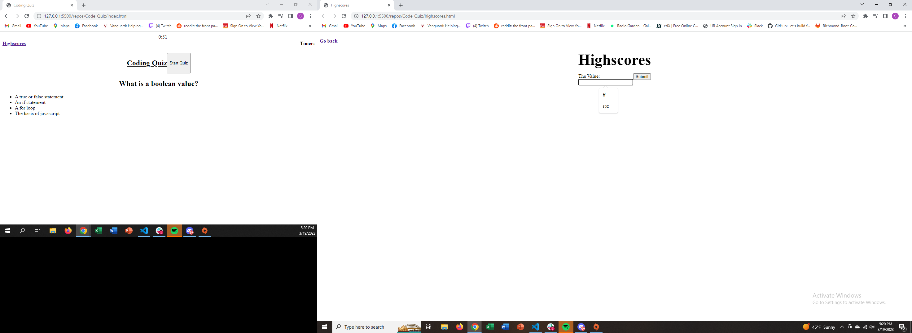

# Code_Quiz

## Description
In this project, I set out to create a short coding quiz. The assignment required me to create a timed multiple choice quiz where if the incorrect answer was selected, time would be subtracted. After the final question, a highscores page would be shown with an area to write in the user's initials.

## license

MIT License

## Screenshot

## Link to Deployed Webpage

https://spzweifel.github.io/Code_Quiz/